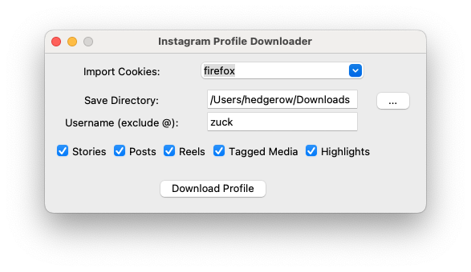

# InstagramProfileDownloader
A simple way to download a user's entire Instagram content. Choose to save Posts, Reels, Highlights, Stories, or Tagged Media!
This is the readme file for version 0.0.1

## How it works
This program is designed as a front-end of sorts for **gallery-dl** when downloading from Instagram. Enter the user's profile name in the username field, choose the directory where you'd like the content to be saved and the kind of media to download, and then the content will be saved to your disk. Because some profiles are private, and because some media (e.g. stories) are only accessible when logged in, I've also made sure to include the option to connect browser cookies. Just make sure you're logged into Instagram in the browser you choose to import from and are following any private accounts you may choose to download from.

## Prerequisites
In order to be able to use this, make sure you have **Python 3.4** or newer installed. With Python installed on your computer, you must then make sure you have **gallery-dl** installed. If you don't have it, run `python3 -m pip install -U gallery-dl` in your terminal, or visit the official GitHub page here: https://github.com/mikf/gallery-dl

## Warnings and limitations
### Warnings
When using an application like this, there is always a risk of getting your Instagram account banned. In my personal experience, I've never had this happen to me, but there is always a risk. So, if you don't want to take any chances, I'd suggest creating a burner Instagram account in a different browser you can import cookies from.

### Limitations
-This program cannot download any deleted media or expired stories.
-So far, there is no way to see the download progress. No confirmation. No nothing. Once you click the "Download Profile" button, the program will appear frozen until the download is complete.
